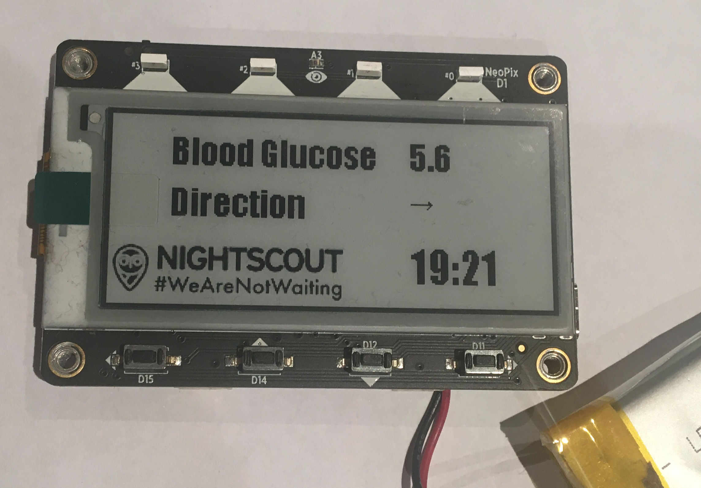

# nightscout_magtag
Use an Adafruit Magtag display to show Nighscout data

This project uses an Adafruit Magtag to display the current time and your Nightscout blood glucose data (and it also 
flashes the Magtag Neopixels with the latest Cheerlights colour to show you it's updated :-) ).

The project has three sources of data:

* Your Nightscout profile
* Adafruit IO time feed
* Cheerlights feed

To see your data all you should need to do is update the secrets.py file with your own personal data (WiFi, Nightscout URL etc.). If you're going
to power this by battery I'd suggest changing the update to less than every minute - although then you'll have to deal with the clock being
slightly out until it next updates.

For more info on any of the parts please see:

* Nightscout: https://nightscout.github.io
* Adafruit IO: https://io.adafruit.com
* Cheerlights: https://cheerlights.com
* Magtag: https://learn.adafruit.com/adafruit-magtag (lots of good projects to learn from on there, most of this code was nicked from the various
projects on there).

Any questions hit me up on Twitter @thebotmakes
